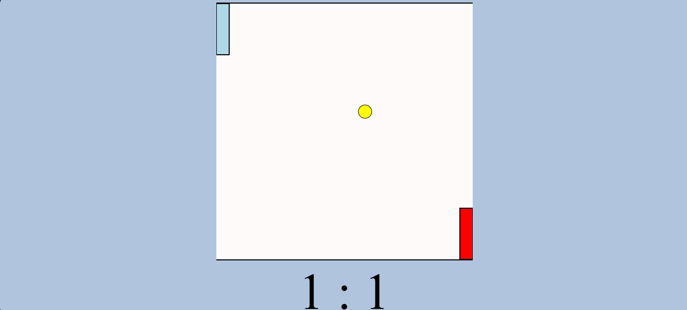
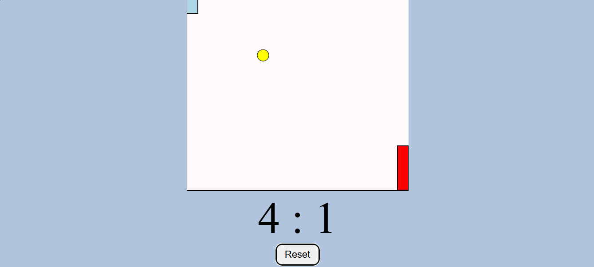

# 🏓 Dynamic Ping Pong Game  

An interactive **2-player Ping Pong game** built with **HTML5 Canvas, CSS, and JavaScript**.  
This project focuses on core **game development concepts** like physics, collision detection, and event handling, while keeping the gameplay fun and engaging.  

---

## 🚀 Features  

* 🏓 **Two-player gameplay** with smooth paddle controls  
* ⏱ **Real-time game loop** for dynamic rendering  
* 🎯 **Collision detection & ball physics** for realistic behavior  
* ⌨️ **Keyboard controls** for both paddles  
* 📊 **Scoring system** with auto reset  
* ⚡ **Difficulty scaling** as the game progresses  
* 🎨 Simple and clean UI with CSS  

---

## 📂 Project Structure

```
├── index.html       # Main structure
├── style.css        # Game CSS styling
├── script.js        # Game logic and mechanics
└── README.md        # Project documentation
```

---

## ⚙️ Tech Stack  

* **HTML5 Canvas** – For game rendering  
* **CSS3** – Styling and layout  
* **JavaScript (Vanilla)** – Core game logic and event handling  

---

## 🎮 How to Use

## 🎮 How to Use

1. Clone this repository:

```bash
git clone https://github.com/cherry024/Dynamic-Ping-Pong-Game
```

2. Open `index.html` in any browser — no installation needed!

---

## 🔧 Functionality Highlights

* ⏱ Game loop handles animation frames
* 🏐 Ball movement with velocity & bounce effects
* 🕹️ Keyboard controls:
     ~ Player 1: W (Up), S (Down)
     ~ Player 2: Arrow Up, Arrow Down
* 📊 Score updates automatically when a player misses the ball
* 🌀 Game resets with increased difficulty

---

## 📸 Preview

<p align="center">
  
  
</p>

---

## 📁 Assets Used

* Screenshot(s) stored in /assets/
* Fonts – Google Fonts (if used)
* Icons/graphics – Custom or free sources

---

## 📌 Notes

* This is a frontend-only browser game built with pure web technologies.
* Perfect for beginners exploring game dev or frontend logic building.
* No external libraries or frameworks used.
---

## 👩‍💻 Author

**Baipureddi Charishma**
📍 Visakhapatnam, India
🎓 B.Tech in ECE (AIML)
💻 Aspiring Developer | Frontend Enthusiast

🌐 [LinkedIn](https://www.linkedin.com/in/charishmaa/)
🌐 [GitHub](https://github.com/cherry024)
